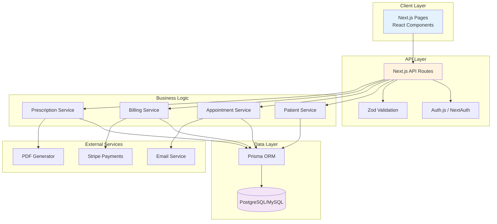

# UML Component Diagram — MedFlow Architecture

## Component descriptions

- **UI (Next.js Pages)**: Client-side rendering, server components, forms, tables.
- **API Routes**: REST endpoints for CRUD operations and business workflows.
- **Auth.js**: Authentication and session management with role-based access control.
- **Zod Validation**: Schema validation for request payloads.
- **Services**: Business logic separated by domain (Patient, Appointment, Billing, Prescription).
- **Prisma ORM**: Type-safe database access and migrations.
- **Database**: PostgreSQL or MySQL for persistent storage.
- **Stripe**: Payment processing in test mode.
- **Email Service**: Appointment confirmations and notifications.
- **PDF Generator**: Prescription export to PDF.
