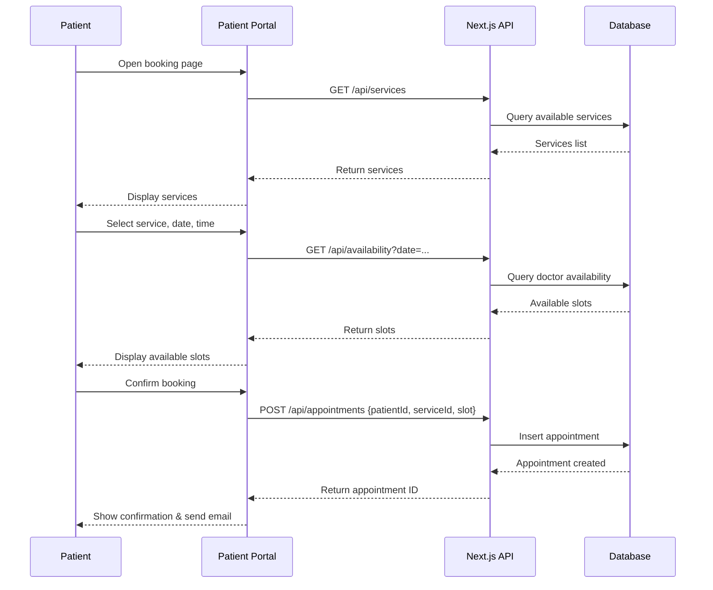

# UML Sequence Diagram — Patient Booking Flow

## Flow summary

1. Patient opens portal and views available services.
2. Patient selects service, date and time.
3. System queries doctor availability for that date.
4. Patient confirms booking.
5. Appointment is stored and confirmation is sent.
