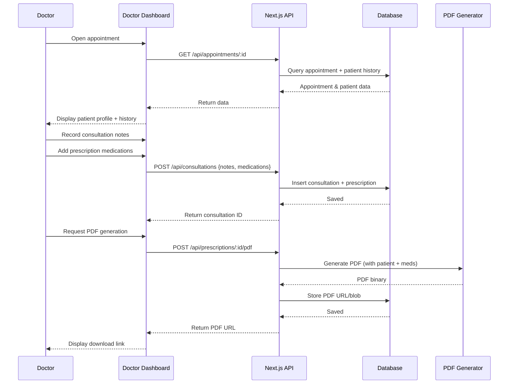

# UML Sequence Diagram — Doctor Consultation & Prescription

## Flow summary

1. Doctor opens appointment from calendar.
2. System loads patient history.
3. Doctor records consultation notes and adds medications.
4. Consultation and prescription are saved to database.
5. Doctor requests PDF; system generates and provides download link.
6. Patient can later download the prescription from their portal.
