# UML Use-Case Diagram — MedFlow

```mermaid
graph TD
    Admin[Admin/Owner]
    Doctor[Doctor]
    Receptionist[Receptionist]
    Patient[Patient]
    
    Admin --> CreateClinic[Create Clinic]
    Admin --> ManageStaff[Manage Staff]
    Admin --> ConfigureServices[Configure Services & Pricing]
    
    Doctor --> ManageAgenda[Manage Agenda]
    Doctor --> RecordConsultation[Record Consultation]
    Doctor --> GeneratePrescription[Generate Prescription]
    Doctor --> ViewPatientHistory[View Patient History]
    
    Receptionist --> RegisterPatient[Register Patient]
    Receptionist --> BookAppointment[Book/Modify Appointment]
    Receptionist --> CreateInvoice[Create Invoice]
    
    Patient --> ViewAppointments[View Appointments]
    Patient --> BookOnlineAppointment[Book Appointment Online]
    Patient --> PayInvoice[Pay Invoice Online]
    Patient --> DownloadPrescription[Download Prescription PDF]
    
    style Admin fill:#e3f2fd
    style Doctor fill:#fff3e0
    style Receptionist fill:#f3e5f5
    style Patient fill:#e8f5e9
```

## Actors

- **Admin (Owner)**: Creates clinic, manages staff, configures services and pricing.
- **Doctor**: Manages appointments, records consultations, generates prescriptions.
- **Receptionist**: Registers patients, books appointments, creates invoices.
- **Patient**: Books appointments online, views documents, pays invoices.

## Key Use Cases

1. **Clinic setup**: Admin creates clinic and configures services.
2. **Patient registration**: Receptionist or admin adds new patients to system.
3. **Appointment booking**: Patient or receptionist books timeslot with doctor.
4. **Consultation workflow**: Doctor records notes, diagnoses, and creates prescription.
5. **Billing & payment**: Receptionist creates invoice; patient pays online (Stripe test).
